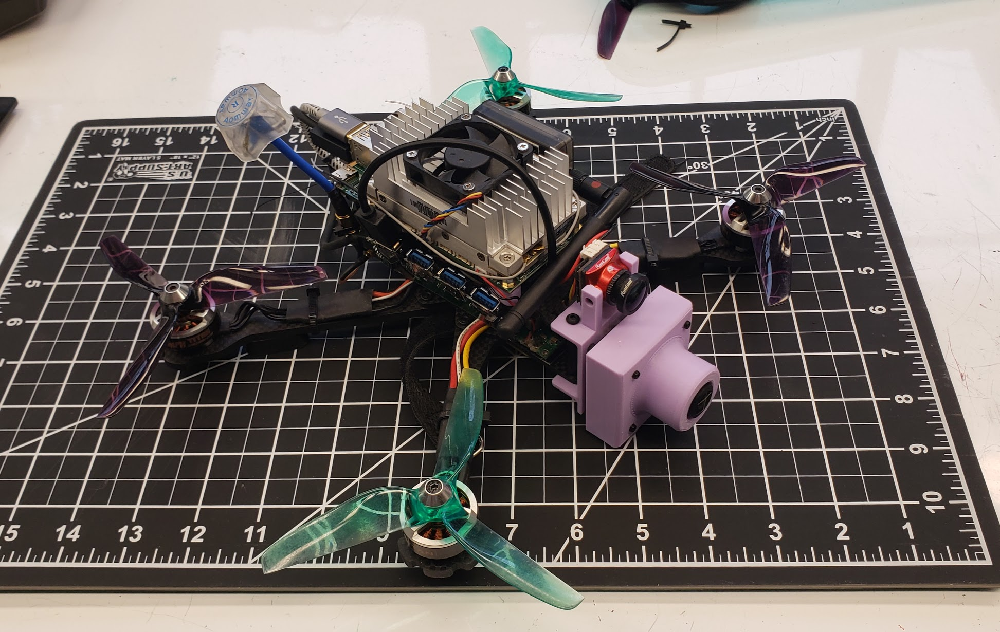

# ACROBAT

Fast autonomous flight

## Hardware



- Nvidia Jetson TX2
- Auvidea J120 Carrier Board
  - mpu9250 IMU
- Arducam [AR0135 Mono Camera](https://www.arducam.com/product/ar0135-1-2mp-monochrome-1-3-inch-cmos-camera-module-arducam/) + [USB3.0 shield](https://www.arducam.com/arducam-usb3-0-camera-shield/)
- Betaflight flight controller (or any other MSP capable flight controller)
  -  [CLRacingF4](https://www.getfpv.com/cl-racing-f4s-flight-controller.html)
  -  Flashed with custom betaflight firmware [acrobat_mod branch](https://github.com/martindeegan/betaflight)
-  Other drone components
   -  Frame - [Lumenier QAV-R 2](https://www.getfpv.com/lumenier-qav-r-2-freestyle-quadcopter-frame.html)
   -  Motors - [Armattan Oomph Titan 2306/2450kv](https://armattanquads.com/armattan-oomph-titan-edition-2306-2450-kv-motor/)

## Installation

### Requirements
- Ubuntu 18.04

### Install Docker
The acrobat software runs in a docker container on the vehicle instead of running natively on the Jetson. To build docker containers you need to install Docker. [Installation Guide](https://www.digitalocean.com/community/tutorials/how-to-install-and-use-docker-on-ubuntu-18-04).

### Install ROS1 Melodic and Simulator

For the simulation we need Melodic.
ROS1 Melodic [installtion page](http://wiki.ros.org/melodic/Installation/Ubuntu).
Install `ros-melodic-desktop-full`.

Setup Catkin workspace and install the [FlightGoggles](https://flightgoggles.mit.edu/) simulator (modified instructions from [here](https://github.com/mit-fast/FlightGoggles/wiki/installation-local)):
```bash
# Setup catkin workspace
mkdir -p ~/catkin_ws/src
cd ~/catkin_ws/
catkin init
cd src
wstool init
# Install FlightGoggles nodes and deps from rosinstall file
wstool merge https://raw.githubusercontent.com/mit-fast/FlightGoggles/master/flightgoggles.rosinstall
wstool update
cd ../
# Install required libraries.
rosdep install --from-paths src --ignore-src --rosdistro melodic -y
# Install external libraries for flightgoggles_ros_bridge
sudo apt install -y libzmqpp-dev libeigen3-dev
# Install dependencies for flightgoggles renderer
sudo apt install -y libvulkan1 vulkan-utils gdb
# Build nodes and download FlightGoggles renderer binary
catkin build 
# NOTE: to avoid downloading the FlightGoggles renderer binary, use the following build command:
# catkin build --cmake-args -DFLIGHTGOGGLES_DOWNLOAD_BINARY=OFF
source ~/catkin_ws/devel/setup.bash
```

To run the simulator (from [here](https://github.com/mit-fast/FlightGoggles/wiki/Running-FlightGoggles)): 
```bash
# To run example environment with joystick/keyboard teleoperation
roslaunch flightgoggles teleopExample.launch
# To run core simulation framework without teleoperation
roslaunch flightgoggles core.launch
```

### Instal ROS2 Eloquent and Acrobat

Acrobat runs on ROS2 Eloquent [installtion page](http://wiki.ros.org/melodic/Installation/Ubuntu). Install `ros-eloquent-desktop`.

DO THIS IN ANOTHER TERMINAL. Setup ROS2 workspace and build code:
```bash
source /opt/ros/eloquent/setup.bash

# Create ROS2 workspace
mkdir -p ~/ros2_ws/src
cd ros2_ws
colcon build --symlink-install

# Use ros2_ws as working dir
source install/setup.bash
cd src
git clone https://github.com/martindeegan/acrobat.git
git clone --branch acrobat_mod https://github.com/martindeegan/msp.git
git clone --branch acrobat_mod https://github.com/martindeegan/serial-ros2.git

# Install required libraries.
rosdep install --from-paths src --ignore-src --rosdistro eloquent -y

# Build ros2 packages
cd ~/ros2_ws
colcon build --symlink-install
```
